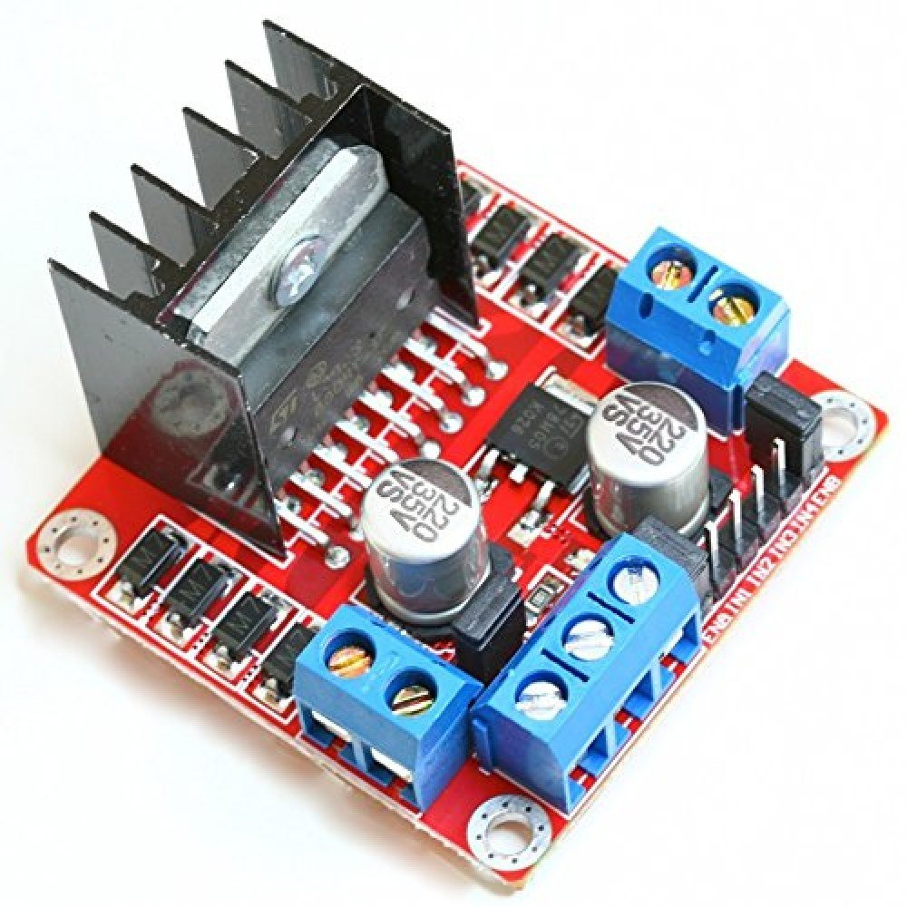
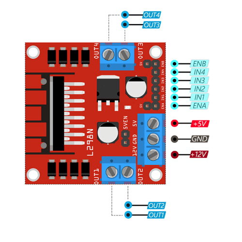
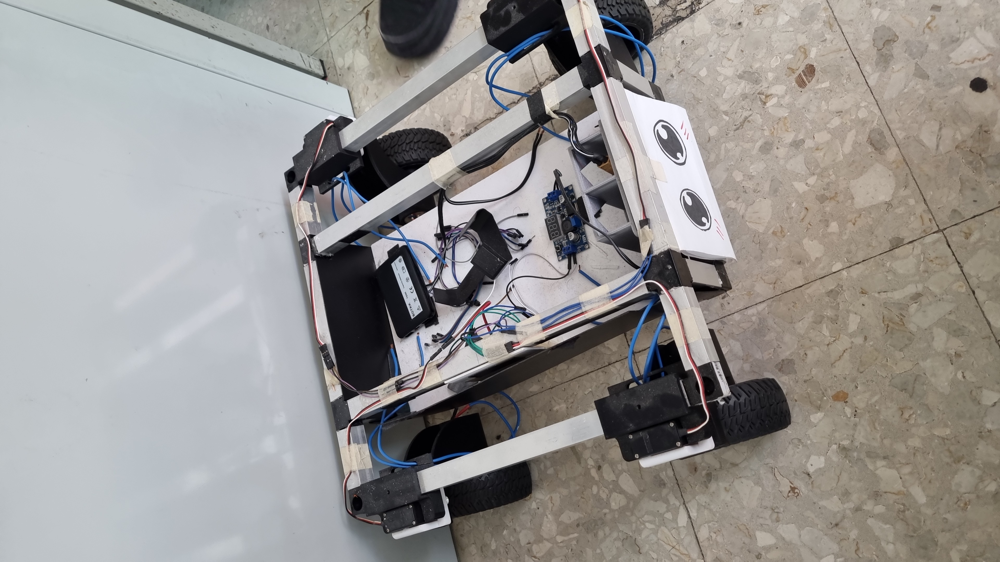
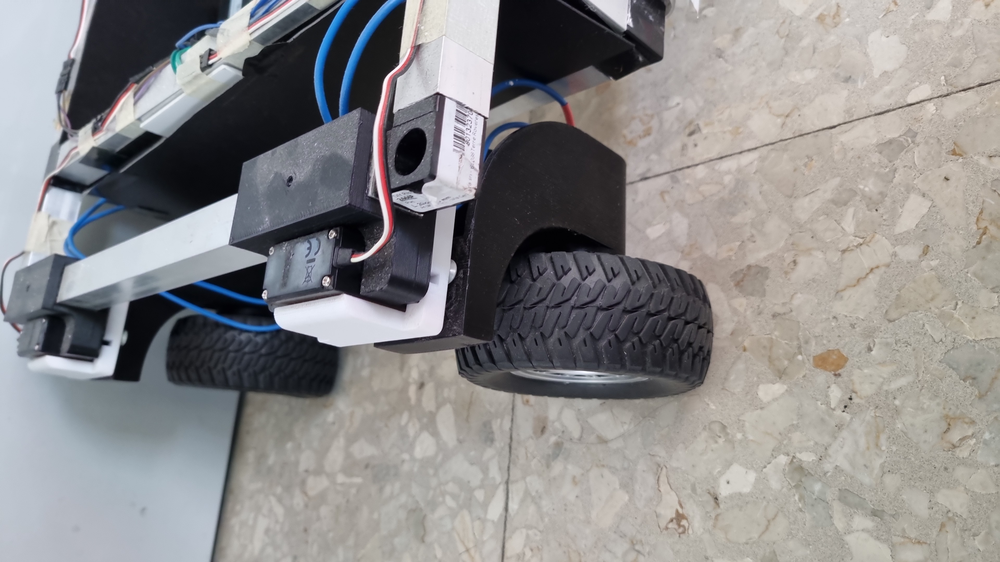
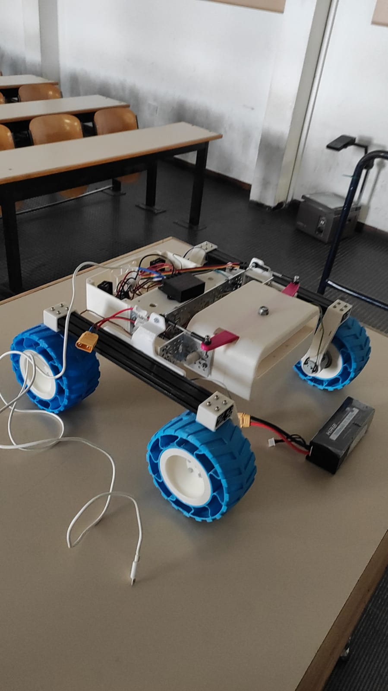

# UOLLI + IV

## Roadmap

- [ ] Farlo funzionare :p

- [ ] Sensori vari (ultrasuoni, ...)

- [ ] Navigazione manuale con tastiera/joystick

- [ ] Navigazione autonoma

- [ ] Integrazione con Jetson/ROS2

## Componenti

### L298N

 

Schede controllo motori usati per IV. (2x)

[Datasheet](assets/L298N_Motor_Driver.pdf)

[IC Datasheet](assets/l298-datasheet.pdf)

### DC step down

Da 12/24V a 5V, max 50W.
Usato per alimentare il Raspberry di IV.

Modello da identificare.

### Batteria 12V

Da prendere

### Motori route

Alimentati dalla scheda motore con 12V. (4x)

Quelli di UOLLI sembrano migliori di quelli di IV.

Non identificati

### Motori servo

Usati dallo sterzo di UOLLI. (4x)

Possibile modello [Futaba S3001](https://futabausa.com/product/s3001/)

## Telai

#### UOLLI (quel che resta)

 

#### IV

## Software

### RPi.GPIO

> This package provides a Python module to control the GPIO on a Raspberry Pi.

> Note that the current release does not support SPI, I2C, hardware PWM or serial functionality on the RPi yet. Although hardware PWM is not available yet, software PWM is available to use on all channels.

[Introduzione](https://learn.sparkfun.com/tutorials/raspberry-gpio/python-rpigpio-api)

[Sourceforge](https://sourceforge.net/projects/raspberry-gpio-python/)

[Pypi](https://pypi.org/project/RPi.GPIO/)

### gpiozero

> A simple interface to GPIO devices with Raspberry Pi

[Documentazione](https://gpiozero.readthedocs.io/en/latest/)

[Github](https://github.com/gpiozero/gpiozero)

[Introduzione](https://www.raspberrypi.com/news/gpio-zero-a-friendly-python-api-for-physical-computing/)

[Pypi](https://pypi.org/project/gpiozero/)

### ROS2

Da vedere

## Scripts

- [Scripts vecchi](https://github.com/Sapienza-Technology/Academy/tree/old/scripts): Collezione sparsa e incompleta. Alcuni usano ROS tramite pyros.

- [Prova route](https://github.com/Sapienza-Technology/Academy/blob/old/testroute.py): Script nabbo per far controllare i motori.

- [Prova server/client](prova): Per mettere sul raspberry lo script `rover.py` che fa da server e connettersi a quest'ultimo dal pc tramite lo script `controller.py`

