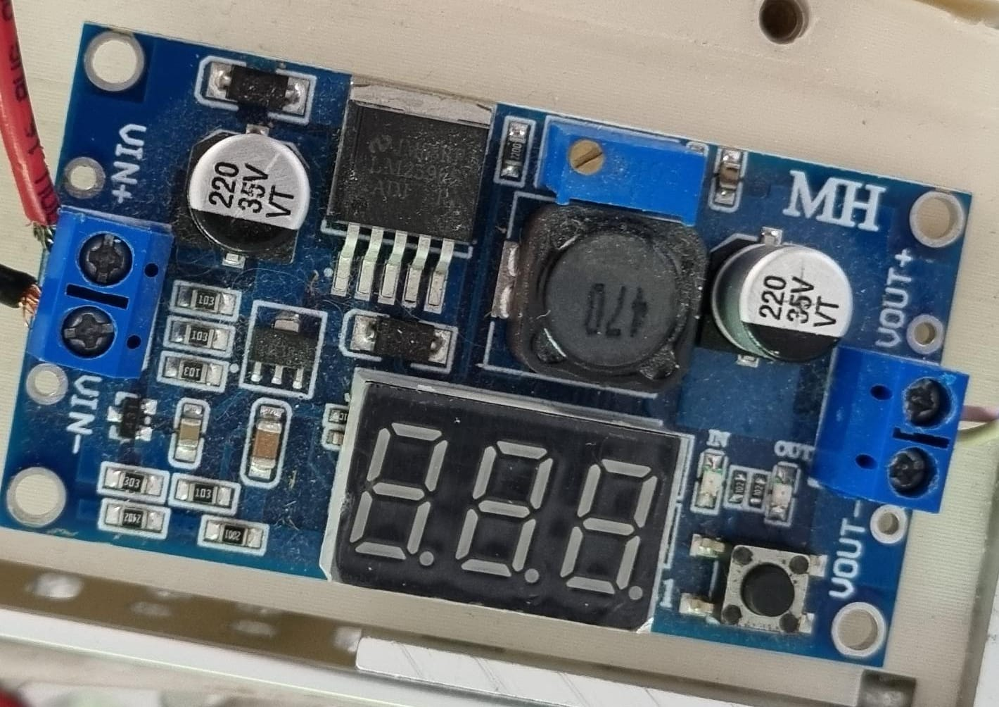
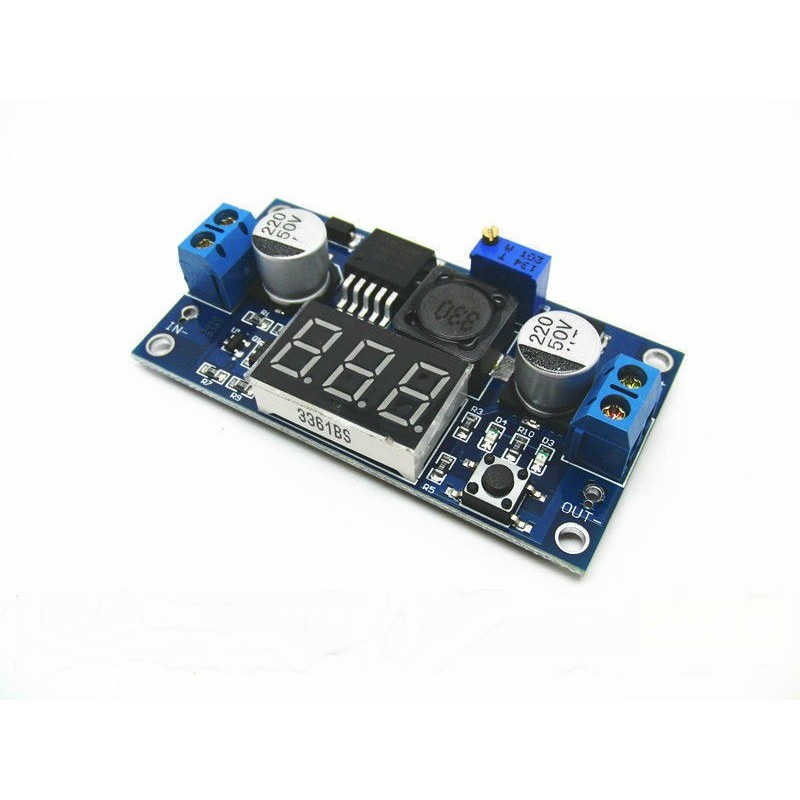
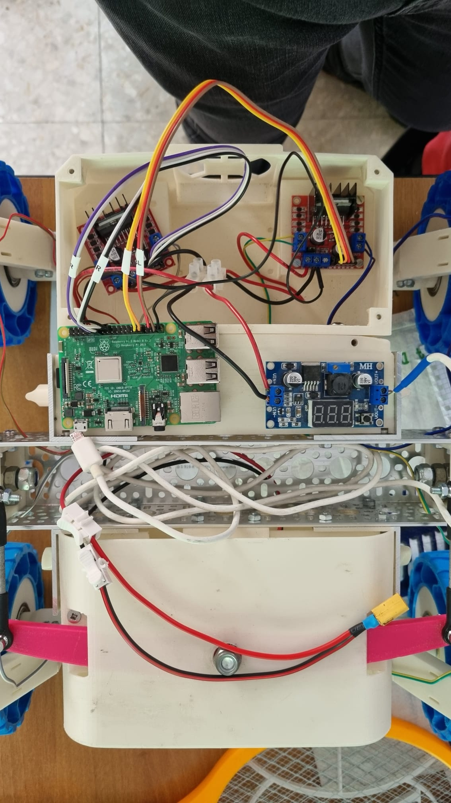

# UOLLI + IV

## Roadmap

- [x] Farlo funzionare :p

- [ ] Aggiungere sterzo

- [ ] Sensori vari (ultrasuoni, ...)

- [ ] Navigazione manuale con tastiera/joystick

- [ ] Navigazione autonoma

- [ ] Integrazione con Jetson/ROS2

## Componenti

### Schede motori

 

Schede controllo motori L298N usati per IV. (2x)

[Datasheet](assets/L298N_Motor_Driver.pdf)

[IC Datasheet](assets/l298-datasheet.pdf)

### DC step down

 

LM2596 con display.

Voltaggio in ingresso: da 4V a 40V
Voltaggio in uscita: da 1.3V a 37V (almeno 1V maggiore dell'ingresso)
Corrente in uscita: 2A (3A picco massimo)

Il voltaggio di uscita si regola con il potenziometro (la vitarella).

Il display mostra il voltaggio in uscita e si spegne premendo il bottone (per ridurre il consumo).

Al momento converte dai 12V delle batterie ai 5V per il raspberry.

[Datasheet](assets/lm2596-datasheet.pdf)

### Batteria 12V

Batteria LiPo da 12V.

### Motori route

Alimentati dalla scheda motore con 12V. (4x)

Quelli di UOLLI sembrano migliori di quelli di IV.

### Motori servo

Parallax Standard Servo, usati dallo sterzo di UOLLI. (4x)

[Datasheet](assets/parallax-datasheet.pdf)

## Telai

#### UOLLI (quel che resta)

 

#### IV

## Cablaggio

## Software

### RPi.GPIO

> This package provides a Python module to control the GPIO on a Raspberry Pi.

> Note that the current release does not support SPI, I2C, hardware PWM or serial functionality on the RPi yet. Although hardware PWM is not available yet, software PWM is available to use on all channels.

[Introduzione](https://learn.sparkfun.com/tutorials/raspberry-gpio/python-rpigpio-api)

[Sourceforge](https://sourceforge.net/projects/raspberry-gpio-python/)

[Pypi](https://pypi.org/project/RPi.GPIO/)

### gpiozero

> A simple interface to GPIO devices with Raspberry Pi

[Documentazione](https://gpiozero.readthedocs.io/en/latest/)

[Github](https://github.com/gpiozero/gpiozero)

[Introduzione](https://www.raspberrypi.com/news/gpio-zero-a-friendly-python-api-for-physical-computing/)

[Pypi](https://pypi.org/project/gpiozero/)

### ROS2

Da vedere

## Scripts

- [Scripts vecchi](https://github.com/Sapienza-Technology/Academy/tree/old/scripts): Collezione sparsa e incompleta. Alcuni usano ROS tramite pyros.

- [Prova route](https://github.com/Sapienza-Technology/Academy/blob/old/testroute.py): Script nabbo per far controllare i motori.

- [Prova server/client](prova): Per mettere sul raspberry lo script `rover.py` che fa da server e connettersi a quest'ultimo dal pc tramite lo script `controller.py`
